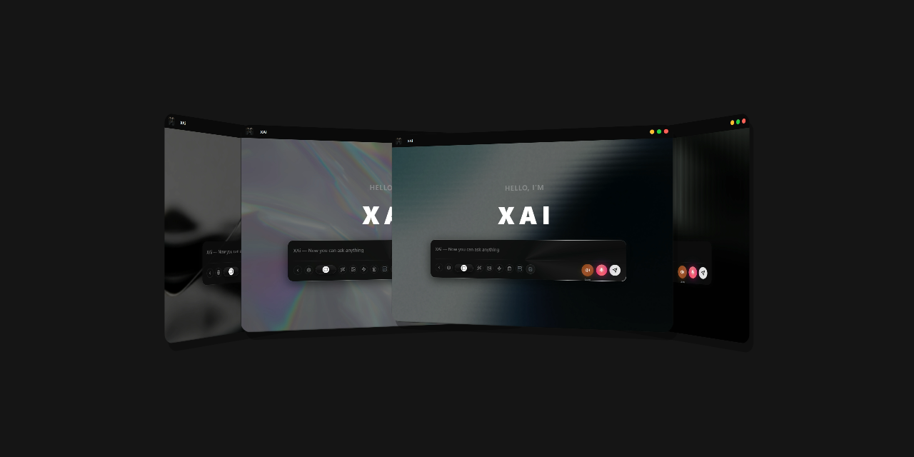
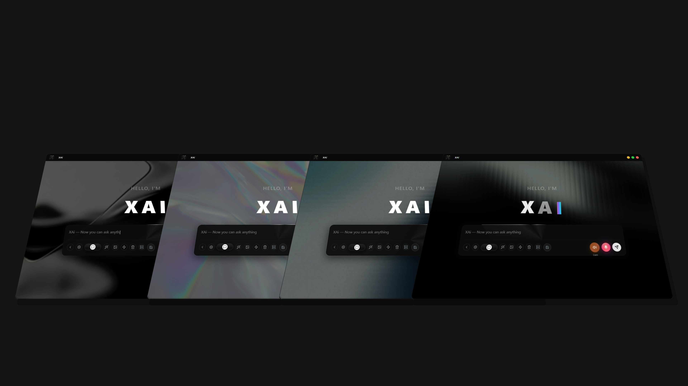

<p align="center">
  
  <h1 align="center">X AI</h1>
  <p align="center">AI chat application</p>
<p align="center">
 <a href="#النسخة-العربية">النسخة العربية</a>

</p>


<div align="center">


**A powerful, feature-rich AI chat application built with Electron, React, and TypeScript**

[Features](#features) • [Installation](#installation) • [Usage](#usage) • [Configuration](#configuration) • [Contributing](#contributing)

</div>

---

## 📖 Table of Contents

- [Overview](#overview)
- [Features](#features)
- [Screenshots](#screenshots)
- [Technology Stack](#technology-stack)
- [Installation](#installation)
- [Usage](#usage)
- [Configuration](#configuration)
- [Keyboard Shortcuts](#keyboard-shortcuts)
- [Project Structure](#project-structure)
- [Development](#development)
- [Building](#building)
- [Contributing](#contributing)
- [License](#license)
- [Author](#author)

---


## 🎯 Overview

XAI is a sophisticated AI chat application that provides a seamless conversational experience with advanced features like voice interaction, context memory, quick prompts, and a beautiful glass-morphism UI. Built with modern web technologies and Electron for cross-platform desktop support.

---

## ✨ Features

### 🎨 Beautiful UI
- **Glass-morphism Design**: Modern, elegant glass-frame styling throughout the application
- **Custom Wallpapers**: Support for multiple wallpaper options
- **Dark Theme**: Optimized dark mode for comfortable viewing
- **Responsive Layout**: Adapts to different screen sizes

### 🎤 Voice Features
- **Text-to-Speech (TTS)**: Convert AI responses to natural speech
- **Speech-to-Text (STT)**: Voice input using microphone
- **Multiple Voice Options**: 10 different voice characters (5 female, 5 male)
- **Radial Voice Menu**: Quick voice switching with elegant radial menu
- **Voice Character Images**: Visual representation of each voice

### 💬 Chat Features
- **Multiple Sessions**: Create and manage multiple chat sessions
- **Chat History**: Access and manage your conversation history
- **Context Memory**: Toggle context-aware responses
- **Quick Prompts**: Pre-defined prompt templates for quick actions
- **Export Chats**: Export conversations as TXT, PDF, or PNG
- **Rename Sessions**: Custom names for your chat sessions

### ⚙️ Advanced Features
- **Model Switching**: Switch between different AI models
- **Vision Support**: Load vision models for image understanding
- **Settings Panel**: Comprehensive settings for customization
- **Keyboard Shortcuts**: Efficient navigation with hotkeys
- **Auto-resize Input**: Smart textarea that adjusts to content

### 🔧 Technical Features
- **Electron Integration**: Native desktop application
- **TypeScript**: Type-safe codebase
- **React Hooks**: Modern React patterns
- **Context API**: Efficient state management
- **Local Storage**: Persistent settings and sessions

---


## 📸 Screenshots

### Main Interface
- Beautiful glass-morphism UI
- Chat input with voice controls
- Quick prompt menu
- Context memory toggle

### Voice Selection
- Radial voice menu with character images
- Quick voice switching
- Voice name indicators

### Settings Panel
- Model configuration
- Voice settings
- Wallpaper selection
- TTS/STT controls

---

## 🛠 Technology Stack

### Frontend
- **React 18.2.0**: UI library
- **TypeScript 5.0**: Type-safe JavaScript
- **Vite**: Fast build tool
- **Lucide React**: Icon library

### Backend/Desktop
- **Electron**: Desktop application framework
- **Node.js**: Runtime environment

### Styling
- **CSS3**: Modern CSS features
- **Glass-morphism**: Blur effects and transparency
- **CSS Variables**: Theme management

### AI Integration
- **LLaMA.cpp**: AI model inference
- **Gemma-4**: Advanced AI model support

---

## 📦 Installation

### Prerequisites
- Node.js (v18 or higher)
- npm or yarn
- Git

### Clone the Repository
```bash
git clone https://github.com/YASSER-27/xai.git
cd xai
```

### Install Dependencies
```bash
npm install
```

### Run Development Server
```bash
npm run dev
```

### Build for Production
```bash
npm run build
npm run dist
```





## 🚀 Usage

### Starting the Application
1. Launch the application
2. Select or load an AI model
3. Start chatting with the AI

### Voice Interaction
1. Click the microphone button to start recording
2. Speak your message
3. Click again to stop and send
4. AI responses can be read aloud using TTS

### Quick Voice Switching
1. Long-press the radial voice button (brown button)
2. Move your mouse to select a voice character
3. Release to confirm selection
4. Voice name appears below the button

### Chat Management
1. **Create New Session**: Click the new session button
2. **Rename Session**: Right-click on session → Rename
3. **Delete Session**: Right-click on session → Delete
4. **Export Chat**: Right-click on session → Export (TXT/PDF/PNG)

### Quick Prompts
1. Click the quick prompt button
2. Select a preset prompt template
3. Customize if needed
4. Send to AI

---

## ⚙️ Configuration

### Settings Panel
Access settings by clicking the settings button or using `/settings` command.

#### Available Settings
- **AI Model**: Select and load AI models
- **Voice**: Choose from 10 voice characters
- **Wallpaper**: Customize background
- **TTS Settings**: Enable/disable text-to-speech
- **STT Settings**: Configure speech-to-text
- **Context Memory**: Toggle context-aware responses

### Model Loading
1. Open Settings
2. Click "Load Model"
3. Select `.gguf` model file
4. Wait for model to load
5. Start chatting

---

## ⌨️ Keyboard Shortcuts

| Shortcut | Action |
|---------|--------|
| `/help` | Show available commands |
| `/settings` | Open settings panel |
| `/scal <value>` | Set UI scale (10-200%) |
| `Ctrl+D` | Toggle history sidebar |
| `Enter` | Send message |
| `Shift+Enter` | New line in input |

---

## 📁 Project Structure

```
xai/
├── electron/              # Electron main process
│   ├── main.ts           # Main entry point
│   └── preload.ts        # Preload scripts
├── src/
│   ├── components/       # React components
│   │   ├── AIPanel.tsx  # Main AI panel
│   │   ├── Settings.tsx # Settings panel
│   │   └── ...
│   ├── context/          # React Context
│   │   └── AIContext.tsx # AI state management
│   ├── data/            # Data files
│   │   └── quickPrompts.ts
│   ├── lib/             # Utility libraries
│   │   └── publicAssets.ts
│   └── pages/           # Page components
│       └── AIPanel.css
├── public/              # Static assets
│   ├── assets/
│   │   ├── voices/     # Voice character images
│   │   └── wallpapers/ # Background images
└── package.json        # Dependencies
```

---

## 🔨 Development

### Running in Development Mode
```bash
npm run dev
```

### Building for Production
```bash
npm run build
```

### Building Electron App
```bash
npm run electron:build
```

### Code Style
- TypeScript for type safety
- Functional components with hooks
- CSS modules for styling
- ESLint for code quality

---

## 🤝 Contributing

Contributions are welcome! Please follow these steps:

1. Fork the repository
2. Create a feature branch (`git checkout -b feature/amazing-feature`)
3. Commit your changes (`git commit -m 'Add amazing feature'`)
4. Push to the branch (`git push origin feature/amazing-feature`)
5. Open a Pull Request

### Guidelines
- Follow the existing code style
- Add tests for new features
- Update documentation as needed
- Ensure all tests pass

---

## 📄 License

This project is licensed under the MIT License - see the [LICENSE](LICENSE) file for details.

---

## 👤 Author

**Yasser**

- GitHub: [YASSER-27](https://github.com/YASSER-27)
- Project: [XAI](https://github.com/YASSER-27/xai)

---

## 🙏 Acknowledgments

- LLaMA.cpp for AI model inference
- React community for excellent libraries
- Electron team for desktop framework
- All contributors and users

---

<div align="center">

**Made with ❤️ by Yasser**

[⬆ Back to Top](#xai---advanced-ai-chat-application)

</div>

---

# XAI - تطبيق الدردشة الذكي المتقدم

<div align="center">


<h2 id="النسخة-العربية">النسخة العربية</h2>

**تطبيق دردشة ذكي قوي ومليء بالميزات مبني باستخدام Electron و React و TypeScript**

[الميزات](#الميزات) • [التثبيت](#التثبيت) • [الاستخدام](#الاستخدام) • [الإعدادات](#الإعدادات) • [المساهمة](#المساهمة)

</div>

---

## 📖 جدول المحتويات

- [نظرة عامة](#نظرة-عامة)
- [الميزات](#الميزات)
- [لقطات الشاشة](#لقطات-الشاشة)
- [التقنيات المستخدمة](#التقنيات-المستخدمة)
- [التثبيت](#التثبيت)
- [الاستخدام](#الاستخدام)
- [الإعدادات](#الإعدادات)
- [اختصارات لوحة المفاتيح](#اختصارات-لوحة-المفاتيح)
- [هيكل المشروع](#هيكل-المشروع)
- [التطوير](#التطوير)
- [البناء](#البناء)
- [المساهمة](#المساهمة)
- [الترخيص](#الترخيص)
- [المؤلف](#المؤلف)

---

## 🎯 نظرة عامة

XAI هو تطبيق دردشة ذكي متطور يوفر تجربة محادثة سلسة مع ميزات متقدمة مثل التفاعل الصوتي، ذاكرة السياق، المطالبات السريعة، وواجهة مستخدم جميلة بتصميم الزجاج. مبني باستخدام تقنيات الويب الحديثة و Electron لدعم سطح المكتب عبر الأنظمة المختلفة.

---

## ✨ الميزات

### 🎨 واجهة مستخدم جميلة
- **تصميم الزجاج**: تصميم عصري وأنيق بتأثيرات الزجاج في جميع أنحاء التطبيق
- **خلفيات مخصصة**: دعم خيارات خلفية متعددة
- **الوضع الداكن**: محسن للراحة البصرية
- **تخطيط متجاوب**: يتكيف مع أحجام الشاشة المختلفة

### 🎤 ميزات الصوت
- **تحويل النص إلى صوت (TTS)**: تحويل ردود الذكاء الاصطناعي إلى كلام طبيعي
- **تحويل الصوت إلى نص (STT)**: إدخال صوتي باستخدام الميكروفون
- **خيارات صوتية متعددة**: 10 شخصيات صوتية مختلفة (5 إناث، 5 ذكور)
- **قائمة الصوت الدائرية**: تبديل الصوت السريع مع قائمة دائرية أنيقة
- **صور شخصيات الصوت**: تمثيل بصري لكل صوت

### 💬 ميزات الدردشة
- **جلسات متعددة**: إنشاء وإدارة جلسات دردشة متعددة
- **سجل الدردشة**: الوصول إلى وإدارة محادثاتك
- **ذاكرة السياق**: تبديل الردود المدركة للسياق
- **مطالبات سريعة**: قوالب مطالبات محددة مسبقًا للإجراءات السريعة
- **تصدير الدردشات**: تصدير المحادثات كـ TXT أو PDF أو PNG
- **إعادة تسمية الجلسات**: أسماء مخصصة لجلسات الدردشة

### ⚙️ ميزات متقدمة
- **تبديل النماذج**: التبديل بين نماذج الذكاء الاصطناعي المختلفة
- **دعم الرؤية**: تحميل نماذج الرؤية لفهم الصور
- **لوحة الإعدادات**: إعدادات شاملة للتخصيص
- **اختصارات لوحة المفاتيح**: تنقل فعال باستخدام المفاتيح الساخنة
- **إدخال تلقائي الضبط**: منطقة نصية ذكية تتكيف مع المحتوى

### 🔧 ميزات تقنية
- **تكامل Electron**: تطبيق سطح مكتب أصلي
- **TypeScript**: كود آمن من حيث الأنواع
- **React Hooks**: أنماط React الحديثة
- **Context API**: إدارة حالة فعالة
- **التخزين المحلي**: إعدادات وجلسات مستمرة

---

## 📸 لقطات الشاشة

### الواجهة الرئيسية
- واجهة مستخدم جميلة بتصميم الزجاج
- إدخال الدردشة مع عناصر تحكم الصوت
- قائمة المطالبات السريعة
- تبديل ذاكرة السياق

### اختيار الصوت
- قائمة الصوت الدائرية مع صور الشخصيات
- تبديل الصوت السريع
- مؤشرات اسم الصوت

### لوحة الإعدادات
- تكوين النموذج
- إعدادات الصوت
- اختيار الخلفية
- عناصر تحكم TTS/STT

---

## 🛠 التقنيات المستخدمة

### الواجهة الأمامية
- **React 18.2.0**: مكتبة واجهة المستخدم
- **TypeScript 5.0**: JavaScript آمن من حيث الأنواع
- **Vite**: أداة بناء سريعة
- **Lucide React**: مكتبة الأيقونات

### الخلفية/سطح المكتب
- **Electron**: إطار عمل تطبيق سطح المكتب
- **Node.js**: بيئة التشغيل

### التنسيق
- **CSS3**: ميزات CSS الحديثة
- **تصميم الزجاج**: تأثيرات الضباب والشفافية
- **متغيرات CSS**: إدارة السمات

### تكامل الذكاء الاصطناعي
- **LLaMA.cpp**: استنتاج نموذج الذكاء الاصطناعي
- **Gemma-4**: دعم نموذج الذكاء الاصطناعي المتقدم

---

## 📦 التثبيت

### المتطلبات المسبقة
- Node.js (v18 أو أعلى)
- npm أو yarn
- Git

### استنساخ المستودع
```bash
git clone https://github.com/YASSER-27/xai.git
cd xai
```

### تثبيت التبعيات
```bash
npm install
```

### تشغيل خادم التطوير
```bash
npm run dev
```

### البناء للإنتاج
```bash
npm run build
npm run electron:build
```

---

## 🚀 الاستخدام

### بدء التطبيق
1. قم بتشغيل التطبيق
2. حدد أو حمّل نموذج ذكاء اصطناعي
3. ابدأ الدردشة مع الذكاء الاصطناعي

### التفاعل الصوتي
1. انقر على زر الميكروفون لبدء التسجيل
2. تحدث برسالتك
3. انقر مرة أخرى للتوقف والإرسال
4. يمكن قراءة ردود الذكاء الاصطناعي بصوت عالٍ باستخدام TTS

### تبديل الصوت السريع
1. اضغط لفترة طويلة على زر الصوت الدائري (الزر البني)
2. حرك الماوس لاختيار شخصية صوتية
3. أطلق لتأكيد الاختيار
4. يظهر اسم الصوت أسفل الزر

### إدارة الدردشة
1. **إنشاء جلسة جديدة**: انقر على زر الجلسة الجديدة
2. **إعادة تسمية الجلسة**: انقر بزر الماوس الأيمن على الجلسة → إعادة التسمية
3. **حذف الجلسة**: انقر بزر الماوس الأيمن على الجلسة → حذف
4. **تصدير الدردشة**: انقر بزر الماوس الأيمن على الجلسة → تصدير (TXT/PDF/PNG)

### المطالبات السريعة
1. انقر على زر المطالبة السريعة
2. حدد قالب مطالبة محدد مسبقًا
3. تخصيص إذا لزم الأمر
4. إرسال إلى الذكاء الاصطناعي

---

## ⚙️ الإعدادات

### لوحة الإعدادات
الوصول إلى الإعدادات عن طريق النقر على زر الإعدادات أو استخدام الأمر `/settings`.

#### الإعدادات المتاحة
- **نموذج الذكاء الاصطناعي**: تحديد وتحميل نماذج الذكاء الاصطناعي
- **الصوت**: الاختيار من بين 10 شخصيات صوتية
- **الخلفية**: تخصيص الخلفية
- **إعدادات TTS**: تمكين/تعطيل تحويل النص إلى صوت
- **إعدادات STT**: تكوين تحويل الصوت إلى نص
- **ذاكرة السياق**: تبديل الردود المدركة للسياق

### تحميل النموذج
1. افتح الإعدادات
2. انقر على "تحميل نموذج"
3. حدد ملف النموذج `.gguf`
4. انتظر تحميل النموذج
5. ابدأ الدردشة

---

## ⌨️ اختصارات لوحة المفاتيح

| الاختصار | الإجراء |
|---------|--------|
| `/help` | عرض الأوامر المتاحة |
| `/settings` | فتح لوحة الإعدادات |
| `/scal <value>` | تعيين مقياس واجهة المستخدم (10-200%) |
| `Ctrl+D` | تبديل شريط السجل |
| `Enter` | إرسال رسالة |
| `Shift+Enter` | سطر جديد في الإدخال |

---

## 📁 هيكل المشروع

```
xai/
├── electron/              # العملية الرئيسية لـ Electron
│   ├── main.ts           # نقطة الدخول الرئيسية
│   └── preload.ts        # نصوص التحميل المسبق
├── src/
│   ├── components/       # مكونات React
│   │   ├── AIPanel.tsx  # لوحة الذكاء الاصطناعي الرئيسية
│   │   ├── Settings.tsx # لوحة الإعدادات
│   │   └── ...
│   ├── context/          # React Context
│   │   └── AIContext.tsx # إدارة حالة الذكاء الاصطناعي
│   ├── data/            # ملفات البيانات
│   │   └── quickPrompts.ts
│   ├── lib/             # مكتبات الأدوات
│   │   └── publicAssets.ts
│   └── pages/           # مكونات الصفحة
│       └── AIPanel.css
├── public/              # الأصول الثابتة
│   ├── assets/
│   │   ├── voices/     # صور شخصيات الصوت
│   │   └── wallpapers/ # صور الخلفية
└── package.json        # التبعيات
```

---

## 🔨 التطوير

### التشغيل في وضع التطوير
```bash
npm run dev
```

### البناء للإنتاج
```bash
npm run build
```

### بناء تطبيق Electron
```bash
npm run electron:build
```

### نمط الكود
- TypeScript لأمان الأنواع
- مكونات وظيفية مع hooks
- وحدات CSS للتنسيق
- ESLint لجودة الكود

---

## 🤝 المساهمة

المساهمات مرحب بها! يرجى اتباع هذه الخطوات:

1. قم بعمل fork للمستودع
2. أنشئ فرع ميزة (`git checkout -b feature/amazing-feature`)
3. التزم بتغييراتك (`git commit -m 'Add amazing feature'`)
4. ادفع إلى الفرع (`git push origin feature/amazing-feature`)
5. افتح طلب سحب

### الإرشادات
- اتبع نمط الكود الموجود
- أضف اختبارات للميزات الجديدة
- قم بتحديث الوثائق حسب الحاجة
- تأكد من اجتياز جميع الاختبارات

---

## 📄 الترخيص

هذا المشروع مرخص تحت ترخيص MIT - راجع ملف [LICENSE](LICENSE) للتفاصيل.

---

## 👤 المؤلف

**ياسر**

- GitHub: [YASSER-27](https://github.com/YASSER-27)
- المشروع: [XAI](https://github.com/YASSER-27/xai)

---

## 🙏 شكر وتقدير

- LLaMA.cpp لاستنتاج نموذج الذكاء الاصطناعي
- مجتمع React للمكتبات الممتازة
- فريق Electron لإطار عمل سطح المكتب
- جميع المساهمين والمستخدمين

---

<div align="center">

**صنع بـ ❤️ بواسطة ياسر**

[⬆ العودة إلى الأعلى](#xai---تطبيق-الدردشة-الذكي-المتقدم)

</div>
